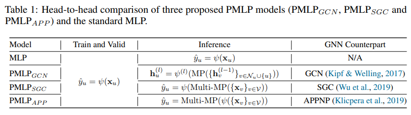
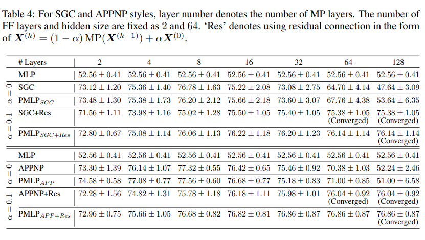
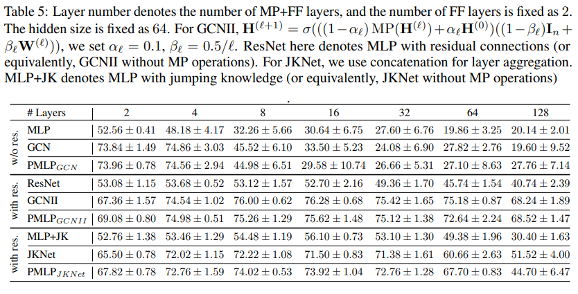

**阅读笔记**

**Graph Neural Networks are Inherently Good Generalizers: Insights by Bridging GNNs and MLPs**

**论文概要**

本文选自ICLR 2023，标题为《Graph Neural Networks are Inherently Good Generalizers: Insights by Bridging GNNs and MLPs》。它更接近于一篇分析性质的文章，试图通过引入一个桥接模型PMLP(Propagational MLP)来刻画传统神经网络模型MLP（多层感知机）和图神经网络GNN的联系与差异所在。桥接模型大体可以被理解为：针对节点分类问题，在训练时只使用MLP学习刻画节点级别的特征；在测试时，引入消息传递机制，将邻居的节点特征加起来再判断分类的准确率。

深度学习研究的两个基本概念是模型的**表示**能力和**泛化**能力。前者关注神经网络能够逼近哪些函数类以及在多大程度上可以最小化经验风险Rb(·)，而后者则侧重于学习过程中的归纳偏差，即所学习函数在未见过的样本和分布之间的泛化能力，通过泛化差距R(·) − Rb(·)来反映。

通过这个中间模型PMLP将图神经网络的两个核心机制前向传播层（FF）和消息传播层（MP）解耦后，作者用MLP、PMLP、GNN三种模型试图从实证和理论两个方面衡量消息传播机制的实际作用，其结论正如标题：作者认为消息传播机制主要增强的其实是**泛化**能力。且作者称图神经网络的泛化能力在先前的文献中研究较少（更多着眼于研究图神经网络是否能够通过引入图拓扑结构学到更好的**表示**）。

基本实证实验得到的结论是：即使在训练中完全不涉及消息传播，PMLP的性能也相对MLP有明显的提升，逼近甚至超过GNN。作者同时认为PMLP架构可作为开销更低的GNN下位替代。

基于更多不同侧面的实验和理论分析，作者确信自己对泛化能力的结论，并基于泛化能力的视角对GNN训练中常被讨论的热点（过平滑、OOD、异配性）给出了自己的解读。

**核心架构：PMLP**

前文已经叙述过：在将GNN的MP和FF操作从层间更新中解耦之后，注意到GNN和MLP之间的关键差异在于是否采用MP（介于输入节点特征和输出预测之间）。为了连接这两个模型族，引入了一种新的模型类别，传播式MLP（PMLP）。

-   训练时其架构与传统的MLP完全相同，即相同的FF。**这意味着它与对应的MLP有一样的权重**。
-   在推断/测试阶段，先以MP把自己与邻居的表示聚合起来，再送给原MLP的非线性函数得到结果。注意此处描述的消息传播是非参数化的。

PMLP的构造方法是通用的，并且可以通过一些细微的修改与许多其他GNN架构兼容，形成一一对应。比如PMLP_GCN在每一层的前馈网络中加入了一个消息传递层，PMLP_SGC在第一层中加入了多个MP层，而PMLP_APP在最后一层中加入，对于具有参数化MP层的GNN（如GAT），可以在预训练的FF层之上使用相应的GNN架构进行模型的额外微调。

作者同时声称：PMLP模型还有以下具体优点

-   PMLP性能与GNN一般差距不高，但在训练过程中显著更高效。事实上，在训练中，PMLP等效于删除所有边的GNNs
-   PMLP对噪声边鲁棒性更好，有助于快速评估GNN架构可行性以促进模型开发
-   PMLP与常见的各类GNN架构与GNN学习任务兼容，修改的开销低

**基于架构的分析**

**实证性评估**

作者主要仍通过节点分类实验评估MLP、PMLP与GNN三个模型的性能并观察其他延伸方面，性能分析得到的结论主要包括

-   **三个PMLP的变体在所有数据集上均大幅优于MLP**
-   在较小的图上，PMLPs与它们的GNN对应模型一样有效，甚至在某些情况下超越了GNNs
-   在较大的图上，此时PMLP仍然明显优于MLP。但PMLP与GNN之间存在一定的性能差距
-   较大的图理论上可能更难从观测数据中提取有信息的特征
-   这可能意味着PMLP在表示能力上依然与GNN存在差距，训练过程中引入MP还是能让模型学到节点级别的更好表示。

**延伸现象观察**

作者进一步进行了更多实验，试图给出更好的insight

-   模型层数和隐藏层大小的影响：MP操作的泛化效果对模型架构的超参数不敏感
-   层数的增加导致三个模型的性能下降，可能是由于过拟合造成的
-   不同激活函数在FF层中的影响：不大
-   在某些情况下，会增强PMLP相对于GCN的性能增益（例如cos激活函数）
-   MP层中不同传播方案的影响：几乎没有变化
-   但在去除自环后，GNN的性能显著下降，而PMLP的准确率几乎保持不变
-   可能的原因是自环连接在GCN的训练阶段对于保留足够中心节点的信息起着重要作用，但不影响PMLP
-   训练比例的影响：对三个模型的相对性能几乎没有影响
-   图稀疏性的影响：固定训练比例的情况下随机删除不同比例的边，当图变得更稀疏时，GCN和PMLP的绝对性能会下降，但它们之间的性能差距保持不变。
-   这表明输入图的质量确实会影响测试性能，并且倾向于影响模型的性能上限。然而，PMLP带来的泛化效果对图的完整性不敏感。
-   噪声结构的影响：噪声结构对GNN的训练和泛化都有负面影响，而PMLP可以缓解这个问题。

**过平滑与深度GNN**

为了更深入地了解过平滑问题和模型深度的影响，作者基于PMLP设计了实验，进一步研究了GNN架构的过平滑原因以及残差连接的作用。

随着神经网络层数的加深，没有残差连接的PMLP的性能与它们的GNN对应相比呈现非常相似的下降趋势（从2层增加到128层），GNN性能常表现得比MLP还差。但似乎PMLP的下降幅度更低，且在引入残差后二者都得到了明显缓解。

在GNN中，这种现象通常被认为是由于**过平滑问题：在多次消息传递后，节点特征变得难以区分**。**但PMLP在训练阶段理论上免疫这个问题**，却在测试中同样表现不佳，作者由此声称**结论：过度平滑更多地与GNN的泛化能力的失效模式相关，而不是削弱其表示能力**。这与先前文献部分一致，其中的作者在理论上展示了非常深的易受过度平滑影响的GNN可以仍然达到很高的训练准确性，但在泛化方面表现不佳。

作者通过实验结果进一步声称，（无论是在MP层中还是在FF层中）额外的残差连接能解决过平滑问题，因为这部分相当于引入PMLP的表征来改善GNN的泛化能力，而已知PMLP的模型深度似乎对泛化性能影响较小。

**异配性**

异配性也是GNN相关文章常被讨论的一个问题。在六个具有高异配性水平的数据集上进行进一步的实验，结论是：

当PMLP的GNN对应能够胜过MLP时，PMLP的性能优于MLP，否则劣于MLP。

这表明某种GNN架构固有的泛化能力也与消息传递机制是否适合数据的特征相关。笔者认为这说明了同配性假设确实存在于一般的消息传递机制内，进而成为影响异配图上GNN性能的主要原因。这也部分解释了为什么训练更专门的GNN架构有助于改善对异质图的模型泛化性能。

**理论分析**

**理论工具**

作者后续主要从神经切线核（NTK）的角度试图比较MLP、PMLP和GNN。作者的分析方式主要就是通过理论工具提出定理，然后在附录里证明提出的各定理，没有很多铺垫，本文直接列出定理隐含的结论

**OOD**

泛化分析的一个重要方面是关于模型在面对OOD测试样本时的行为，即特征明显位于训练范围之外的测试节点，所谓的外推分析。之前的研究（Xu等，2021）揭示了标准的带有ReLU激活函数的MLP在测试样本超出训练支持范围时很快收敛到线性函数。

-   Theorem 3：背后的直觉是，基于ReLU的MLP学习具有有限个线性区域的分段线性函数，因此在训练数据范围之外最终变得线性。
-   从MLP扩展到PMLP时，随着测试节点特征越来越远离训练数据的范围，类似于MLP，采用Avg. pooling的PMLP（以及GNN）也收敛到一个线性函数，但对应的线性系数反映了图属性，而不是一个固定的常数。
-   Theorem 4：尽管MLP和PMLP在极端测试样本上都趋向于线性化，表明它们在外推非线性函数方面存在共同的困难，但PMLP从收敛的线性系数中偏离的自由度更高，**意味着从分布内（非线性）到分布外（线性）区域的过渡更加平滑，因此可能能够推广到接近训练数据范围的分布外样本。**
-   Theorem 5：节点的度越大和特征的差异性越强，意味着更平滑的过渡和更好的与分布外样本的兼容性。
-   测试节点的度数为1（与自身连接）时，PMLP等同于MLP
-   当所有节点的特征相等时，消息传递变得无意义，PMLP等同于MLP

作者理论分析得到的最后的结论是：尽管MLP和PMLP都无法外推非线性函数，但PMLP的收敛速度较慢，表明其具有更平滑的过渡和更好的对超出分布的样本的容忍能力。

**笔者评价**

**总体评价与Novelty**

在openreview上可以找到评审的相关评价，该文章的novelty一度被质疑。这其实是部分合理的，作者也承认这个PMLP模型等价于训练过程中去掉所有边的GNN，且类似的模型在先前的文献中已经有出现过。而且文章主体的实验部分给人的感觉比较常规。最后给人感受到的工作量不多，在补充了更多实验和分析，回应评委的一些问题后这篇论文评审通过。

笔者认为这篇文章有价值的点更多在于其提供的insights，通过一个自己造的视角给出了对GNN架构本身的理解并联系到了一些GNN常见的讨论点，部分带来了一点可解释性。近年来GNN领域涉及到OOD、异配性之类的各式相关研究和模型不少，研究价值甚至一度被质疑。笔者认为这种梳理、反思式的文章还是很能增进理解，有助于做好实际研究的。当然具体到这篇来说，得出的一些结论总结起来也还是比较初步，一些地方只能说是开了个头，有待于进一步探索。

**开销**

作者在文中提到但基本只是一笔带过的部分便是开销：作者声称其的PMLP模型训练速度明显更快，"5 ∼ 17× faster on large datasets, and 65× faster for very deep GNNs with more than 100 MP layers"；且修改对应的GNN架构成为PMLP的迁移开销很低。

尽管GNN的参数量通常不是很大，但图拓扑结构以及消息传递机制已经明显成为了GNN训练的一大瓶颈：不像其他领域比如图像的训练，前向传播和反向传播因不同节点邻居关系不同而很难统一地向量化，造成优化上的困难。在分布式训练中困难更加明显，在一些很大的图数据集上，可能一个主机甚至只能存下图的一部分节点与边，形成子图。那么跨子图的消息传递训练意味着主机间频繁通信，已经有过多篇文献讨论过这个问题并尝试优化之。

但类PMLP的机制意味着训练回到了传统MLP，因此不存在这方面的训练开销，这可能能让PMLP成为实际训练中的替代方案，至少有助于实际GNN开发中的降本增效和开发前的风险评估，经过这篇论文的系统衡量后，在一些图拓扑关系不那么强的实际落地项目中也许能成为更经济的选择。
